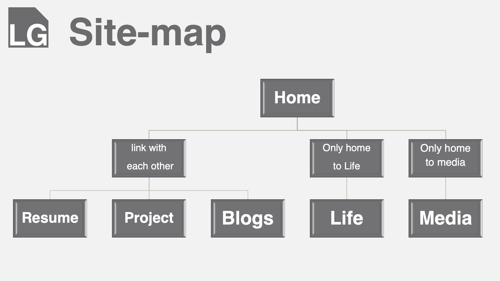
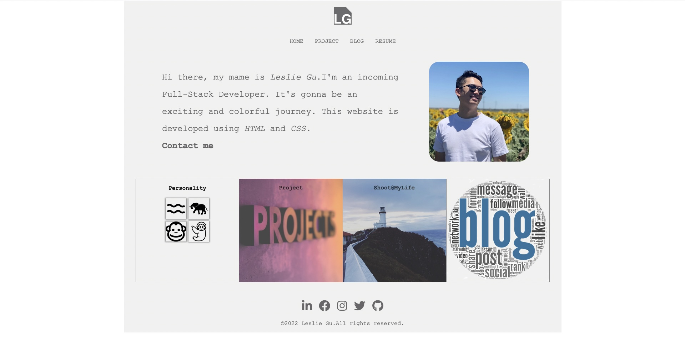
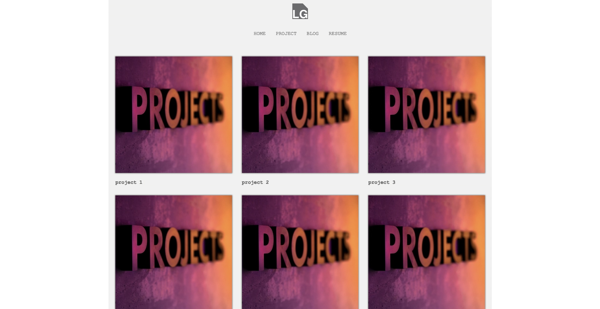
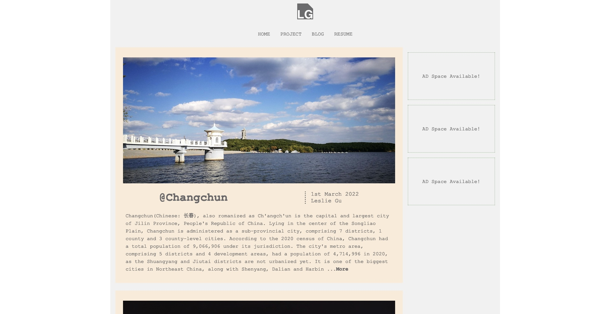
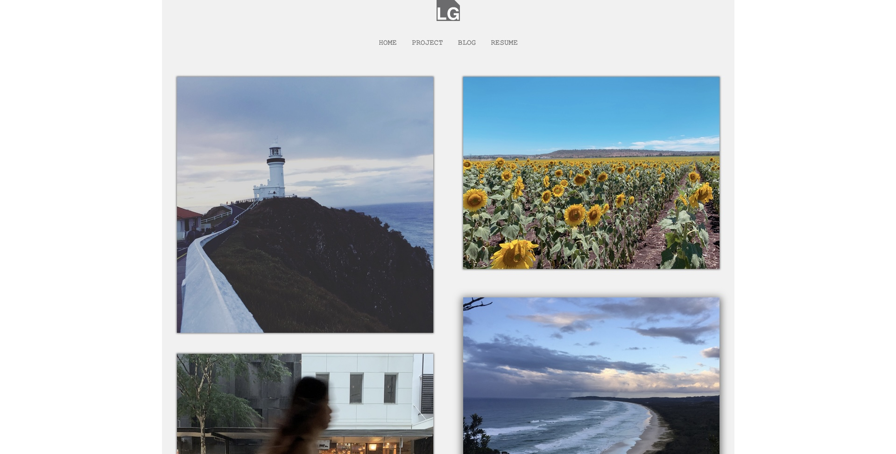
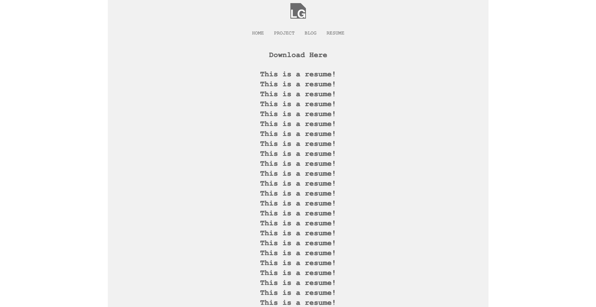

# T1A2 - Portfolio Website

[makecoolstuff](https://lesles1992.github.io/XuefengGu_T1A2/index.html)

[github repo](https://github.com/LesLes1992/XuefengGu_T1A2)

## Purpose

This is a project to practice HTML and CSS skills. The website shows my personal information as well. In the future I will update this website to reflect my improved skills.

## Features

This site structure features 5 pages to direct the audience to view my work and contact me directly:

- The Home page 4 parts, which are navibar, intro, personal content display(personality/interest/blog/project), footer.

- The Projects page contains a link to all my projects.

- The Blog page contains 5 blogs about the cities I was born, studied and worked in.

- The Resume page show a mocked up resume which will update in the future.

- The shoot@mylife page shows the photograph I shot during travelling.

All pages are responsive between different screen sizes .

## Site Map

Home page will link to all the other web.

## Screenshots

### Home

### Project

### Blog

### Interest

### Resume

## Target Audience

Target Audience is all the employers .

The website is friendly to screen reader users.

## Tech stack

The site is using tech with css and html. In the future I will constantly upgrade with new techs and make sure this portfolio website fancier.

This website will be deploied on github page.

#
